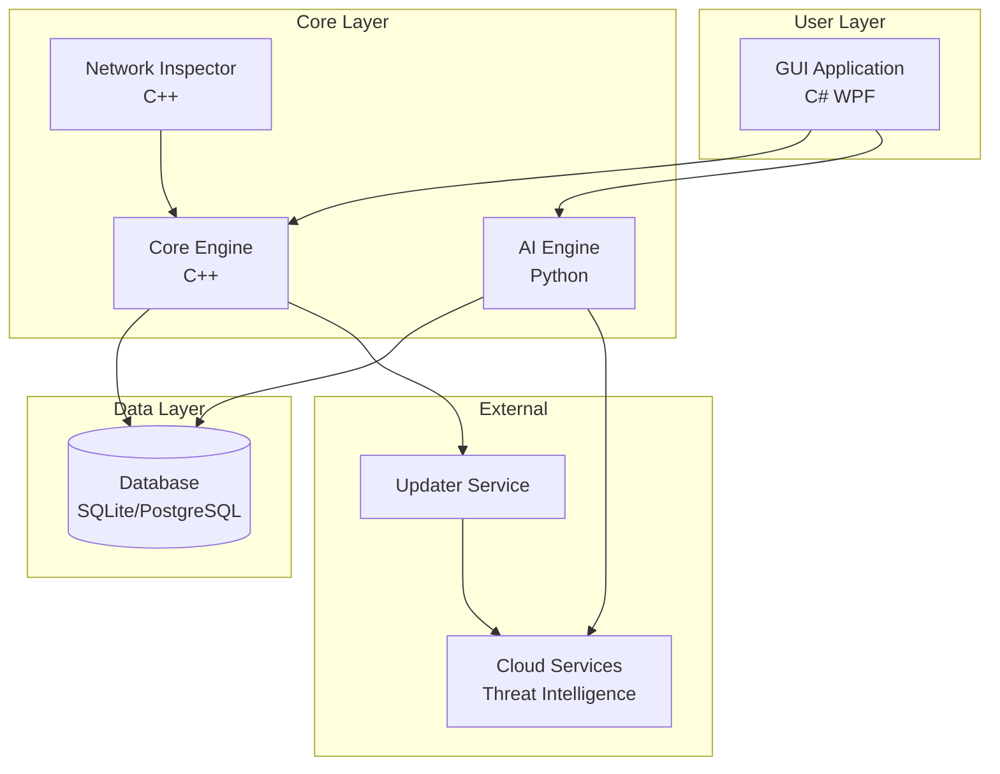

# System Architecture

## Overview
The antivirus employs a modular, microservice-inspired architecture designed for high performance, scalability, and robustness. Components are loosely coupled, allowing independent development, testing, and deployment. Communication between modules uses secure, encrypted channels to prevent tampering.

## Core Components

### 1. Core Scanning Engine (C++)
- **Responsibilities**:
  - Signature-based and heuristic scanning
  - Real-time file system and process monitoring
  - Behavioral analysis hooks
  - Integration with Windows APIs (e.g., AMSI, ETW)
- **Performance**: Optimized for minimal CPU/GPU usage using SIMD instructions and multi-threading
- **Security**: Runs in protected memory space with anti-debugging measures

### 2. AI/ML Engine (Python with TensorFlow/PyTorch)
- **Responsibilities**:
  - Anomaly detection using deep learning models
  - Predictive threat modeling
  - Feature extraction from files/processes
  - Continuous model training and adaptation
- **Capabilities**: Supports federated learning for privacy-preserving updates
- **Integration**: Exposed via REST API or gRPC for inter-module communication

### 3. Graphical User Interface (C# WPF/WinUI)
- **Responsibilities**:
  - Dashboard for real-time monitoring
  - Scan management and reporting
  - Settings and customization
  - Alert notifications with AI-suggested actions
- **Features**: Supports themes, accessibility, and future AR integration
- **Performance**: Asynchronous UI updates to maintain responsiveness

### 4. Database Layer (SQLite for local, PostgreSQL for enterprise)
- **Responsibilities**:
  - Storage of malware signatures, threat logs, and AI model metadata
  - Query optimization for fast lookups
  - Backup and synchronization
- **Security**: Encrypted at rest with SQL injection protection

### 5. Updater and Cloud Service
- **Responsibilities**:
  - Secure download of signature updates and AI model patches
  - Blockchain-verified update integrity
  - Peer-to-peer threat sharing
- **Features**: Offline caching and delta updates for efficiency

### 6. Network Inspector (C++)
- **Responsibilities**:
  - Deep packet inspection
  - SSL/TLS interception for threat analysis
  - Integration with AI for URL reputation
- **Security**: Certificate pinning and zero-trust networking

## Architecture Diagram

## Data Flow
1. **Scan Initiation**: GUI sends scan request to Core Engine.
2. **Analysis**: Core Engine performs initial checks, forwards suspicious data to AI Engine.
3. **Decision**: AI Engine classifies threats, updates database.
4. **Response**: Core Engine takes action (quarantine, alert), GUI displays results.
5. **Update**: Updater fetches new data from cloud, updates DB and models.

## Scalability and Robustness
- **Modularity**: Each component can be scaled independently (e.g., multiple AI instances).
- **Fault Tolerance**: Redundant processes with automatic failover.
- **Resource Management**: Dynamic allocation based on system load.
- **Extensibility**: Plugin architecture for third-party modules.

## Security Measures
- End-to-end encryption for all communications.
- Code signing and integrity checks.
- Sandboxed execution environments.
- Regular security audits and penetration testing.